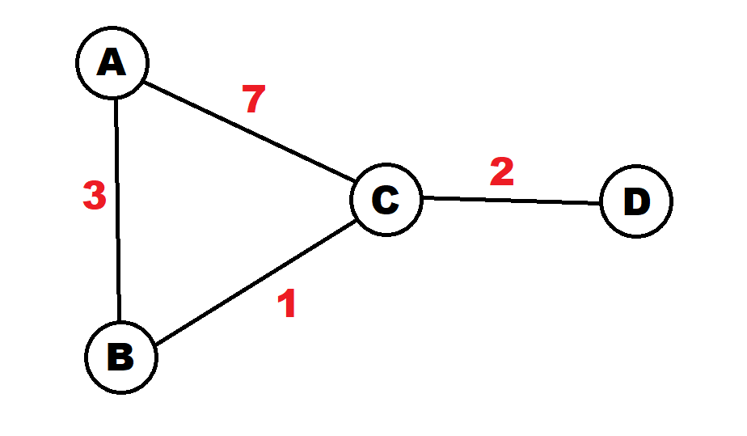

# Dijkstra's Algorithm C++

This is my implementation of Dijkstra's Algoritm in C++. It reads in the graph over STDIN in a list of single space separated edges. Each edge is defined inside [], with 3 comma separated parameters, two nodes and a weight. Vertices must be an uppercase char and weights, an unsigned int.

`example: [A,B,3] [B,C,1] [A,C,7] [C,D,2]`

This input above represents the graph shown below:



It then reads in the goal of the algorithm, for example the shortest path from A to D with a maximum cost of 10. This is given by the name of each of the to vertices separated by a `->` followed by a comma and the maximum path length as an unsigned int.

`example: A->D,10`

Using the example input above would produce the following result over STDOUT:

```SUCCESS: A->B->C->D```

```Cost: 6```
